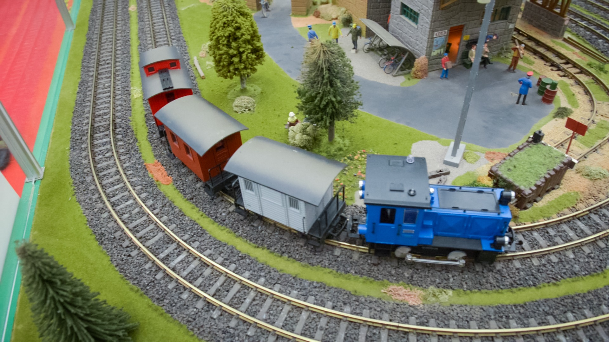
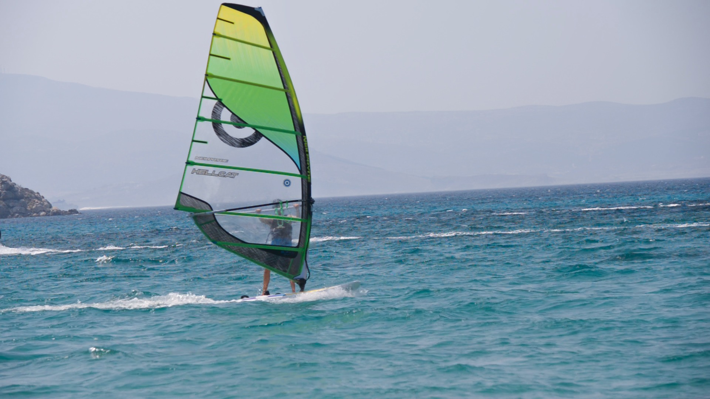

# ONNX SEA-RAFT
This repo provides a converter for the official pytorch-based SEA-RAFT model to an onnx model along with a demo code for using the onnx model. SEA-RAFT is a more simple, efficient and accurate RAFT for optical flow model. For further details, please refer to [official repo](https://github.com/princeton-vl/SEA-RAFT) and [paper](https://arxiv.org/abs/2405.14793).

<div style="display: flex; gap: 10px;">
  
  
</div>

<div style="display: flex; gap: 10px;">
  
  
</div>

## Get Started
This section explains demo code usage. convert torch model to onnx model is explained in the [Convert torch model to onnx model](#convert-torch-model-to-onnx-model) section.

### Installation
1. Clone this repo.
```
# recursive is must not required
git clone https://github.com/Kololu777/onnx-sea-raft.git
cd onnx-sea-raft
```

2. Create the environment.
Devcontainer or pip install as shown below. For details on using the Docker image.
```
pip install -r install/requirements.txt
```

3. Demo code
Usage of demo code is shown below. How to convert torch model to onnx model is refer to [Convert torch model to onnx model](#convert-torch-model-to-onnx-model) section.

```
python3 demo/run.py -m raft.onnx -im1 <image1_path> -im2 <image2_path>
```

Examples:
```
python3 demo/run.py -m raft.onnx -im1 assets/train/00000.jpg -im2 assets/train/00015.jpg
```

## Convert torch model to onnx model 
### Installation
1. Clone this repo.
```
git clone --recursive https://github.com/Kololu777/onnx-sea-raft.git
# if you have already cloned onnx-sea-raft:
# git submodule update --init --recursive
cd onnx-sea-raft
```

2 Create the environment.
Devcontainer or pip install as shown below. For details on using the Docker image, please refer to [Usage Devcontainer](.devcontainer/README.md).
```
pip install -r install/requirements-dev.txt
```

3. Convert code
Pytorch code to onnx code is provided in `convert/torch_to_onnx.py`. Usage is as follows.
For further details, please refer to [Converter README](converter/README.md).

```sh
python3 converter/torch_to_onnx.py --cfg configs/eval/sintel-M.json --url MemorySlices/Tartan-C-T-TSKH-spring540x960-M
```

## License
[SEA-RAFT](code/SEA-RAFT) was published under a BSD 3-Clause License. 
Assets folder is part of DAVIS dataset. Therefore, assets folder is under CC-BY-NC-4.0 license as DAVIS dataset. 
[README.md](README.md) using photo is refer to Assets folder, [README.md](README.md) is also under CC-BY-NC-4.0 license. All other parts of the repository are licensed under the Apache License 2.0.


## References
- [SEA-RAFT](https://github.com/princeton-vl/SEA-RAFT)
